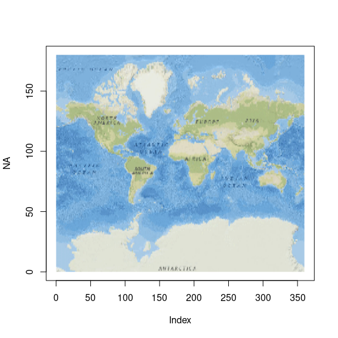
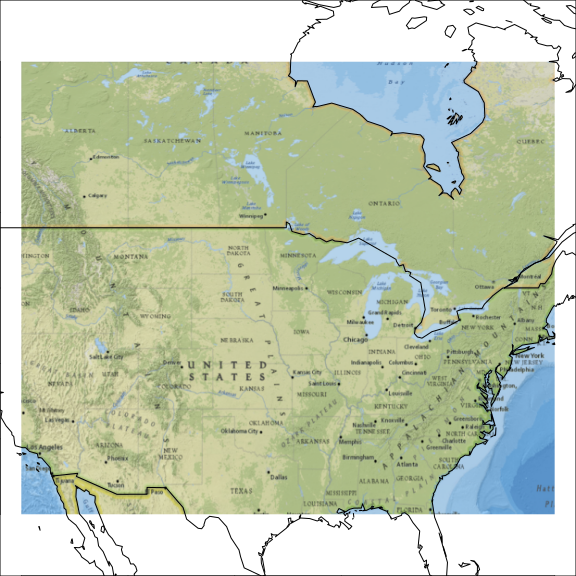

<!-- README.md is generated from README.Rmd. Please edit that file -->

# xrgdal

<!-- badges: start -->
<!-- badges: end -->

The goal of xrgdal is to provide user friendly hooks to GDAL.

This is a first experiment and what user-tools might look like, with
objects keeping a live GDAL pointer open for efficient use (like rgdal
did).

Beware, this is very raw and will crash. The code below is just some
pathways I’ve engineered to work as a proof of concept. The real work is
in [vapour](https://github.com/hypertidy/vapour), which has a friendly
UI [gdalio](https://github.com/hypertidy/gdalio) for raster data, and
there are helpers for abstract logic in
[vaster](https://github.com/hypertidy/vaster) and
[gdalwebsrv](https://github.com/hypertidy/gdalwebsrv) and
[grout](https://github.com/hypertidy/grout) that I’m working into a
suite of tools for development of R software and access to data.

I’d like to see R7 classes that reflect all the underlying functionality
of GDAL, like there is with
[rasterio](https://rasterio.readthedocs.io/), but we don’t need
everything I expect, just start with the main things to read and
reproject rasters for now.

## Installation

I actually strongly recommend not doing this. It’s too early.

You can install the development version of xrgdal from
[GitHub](https://github.com/) with:

``` r
# install.packages("devtools")
devtools::install_github("mdsumner/xrgdal")
```

## Example

We have a raster data source (it’s an XML config around an online tile
server, you can just use your own GeoTIFF etc file/s).

This is an “XYZ” image tile server that simply serves up png or jpeg
images from a tile system, there are 17 `$z`oom levels, 3 bands, and
each tile is 256x256.

GDAL has this format for reading from this non-georeferenced raster
source, which is this string `imgsrc`.

``` r
template <- 
  '<GDAL_WMS>
    <Service name="AGS">
        <ServerUrl>%s</ServerUrl>
    </Service>
    <DataWindow>
        <UpperLeftX>-20037508.34</UpperLeftX>
        <UpperLeftY>20037508.34</UpperLeftY>
        <LowerRightX>20037508.34</LowerRightX>
        <LowerRightY>-20037508.34</LowerRightY>
        <TileLevel>17</TileLevel>
        <TileCountX>1</TileCountX>
        <TileCountY>1</TileCountY>
        <YOrigin>top</YOrigin>
    </DataWindow>
    <Projection>EPSG:3857</Projection>
    <BlockSizeX>256</BlockSizeX>
    <BlockSizeY>256</BlockSizeY>
    <BandsCount>3</BandsCount>
    <MaxConnections>10</MaxConnections>
    <Cache />
</GDAL_WMS>
'
server <- "http://services.arcgisonline.com/ArcGIS/rest/services/NatGeo_World_Map/MapServer/"
imgsrc <- sprintf(template, server)
```

With xrgdal, we can open this raster and make some queries of it. These
are opaque external pointers atm, so there’s only some small set of
functions that understand what is available.

``` r
po <- GDALOpen_cpp(imgsrc, 0)
(dms <- xrgdal_RasterSize(po))  ## it's very big!
#> [1] 33554432 33554432
xrgdal_GetRasterCount(po)  ## there are 3 bands (RGB)
#> [1] 3

## get the first band and find out how many overviews (zooms)
band1 <- xrgdal_GetRasterBand(po, 1)
xrgdal_GetOverviewCount(band1)
#> [1] 17
## and what is the blocksize
xrgdal_GetBlockSize(band1)
#> [1] 256 256
```

We know its dimensions and we know how many bands, so let’s get some
values!

``` r
smalldims <- c(360, 180)
v <- xrgdal_RasterIO(po, window = c(0, 0, dms, smalldims), bands = 1:3)
str(v)
#> List of 3
#>  $ : num [1:64800] 129 121 121 126 123 121 123 121 118 118 ...
#>  $ : num [1:64800] 179 172 172 177 174 172 174 172 169 169 ...
#>  $ : num [1:64800] 222 214 214 220 217 214 217 214 212 212 ...
```

Thankfully (!!) we didn’t read all zillions of pixel values, the
`window` argument told us where to start `0, 0` (the topleft corner),
where to finish - `dms[1]` pixels to the right, `dms[2]` pixels to the
bottom (the right and bottom edge in this case) - and how many values to
actually obtain `360, 180`. It would take an age to scan through such a
big image, but because it has overviews (a.k.a ‘zoom levels’) GDAL is
actually smart enough to choose the closest overview to our requested
size.

These are rgb values, and we can do stuff with that.

``` r
a <- array(unlist(v), c(smalldims, 3L))/255
plot(NA, xlim = c(0, smalldims[1]), ylim = c(0, smalldims[2]))
rasterImage(aperm(a, c(2, 1, 3)), 0, 0, smalldims[1], smalldims[2])
```



Now, that looks terrible. So, let’s find out what our image device would
like and go with that.

``` r
par(mar = rep(0, 4), xpd = NA)
smalldims <- rep(max(dev.size("px")), 2L)
a <- array(unlist(xrgdal_RasterIO(po, window = c(0, 0, dms, smalldims), bands = 1:3)), 
           c(smalldims, 3L))/255
plot(NA, xlim = c(0, smalldims[1]), ylim = c(0, smalldims[2]), xpd = NA, asp = 1)
rasterImage(aperm(a, c(2, 1, 3)), 0, 0, smalldims[1], smalldims[2])
```


## Warping to get an obvious image extent

``` r
par(mar = rep(0, 4), xpd = NA)
smalldims <- rep(max(dev.size("px")), 2L)
xlim <- c(-120, -70)
ylim <- c(30, 60)
warp <- xrgdal_Warp(po, extent = c(xlim, ylim), dimension = smalldims, projection = "OGC:CRS84")
a <- array(unlist(xrgdal_RasterIO(warp, window = c(0, 0, smalldims, smalldims), bands = 1:3)), 
           c(smalldims, 3L))/255
plot(NA, xlim = xlim, ylim = ylim, asp = 1/cos(mean(ylim) * pi/180))
rasterImage(aperm(a, c(2, 1, 3)), xlim[1], ylim[1], xlim[2], ylim[2])
maps::map(add = TRUE)
```



etc etc

## Warping to get exactly what we want

TBD

## Using resampling and/or matching the native resolution

TBD

## Churning tiles

TBD

## Merging disparates sources

TBD
